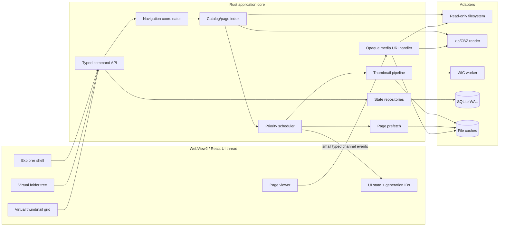
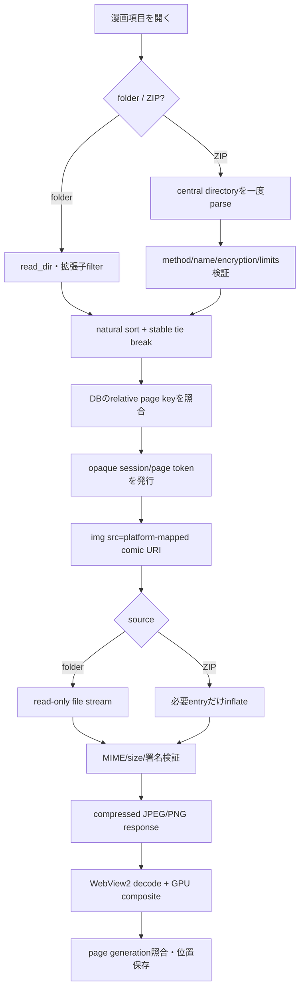
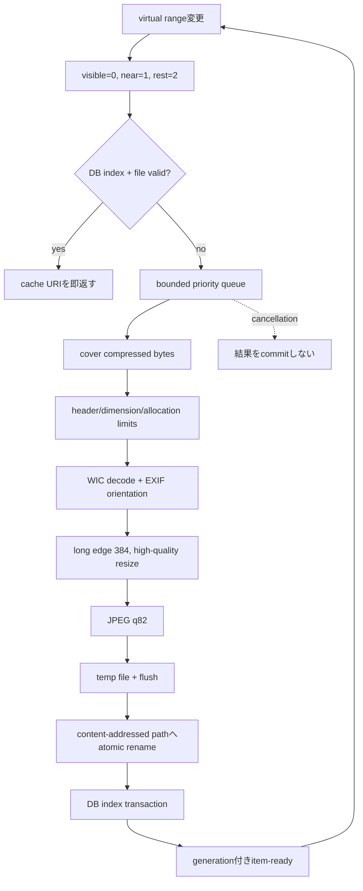
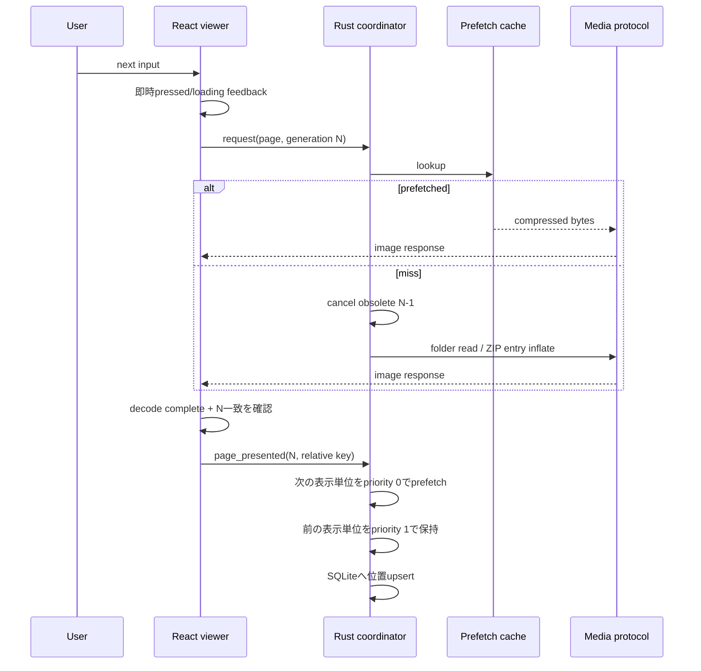
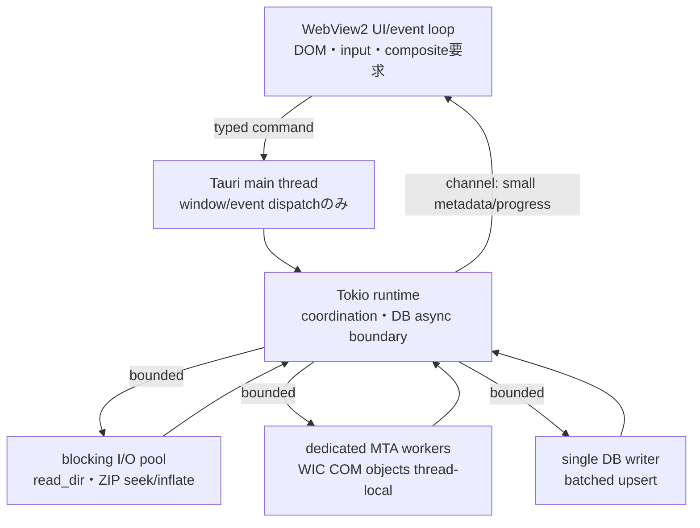

---
codd:
  node_id: "design:architecture"
  type: design
  status: approved
  confidence: 0.86
  depends_on:
    - id: "req:mvp-requirements"
      relation: "implements"
      semantic: "governance"
    - id: "doc:technology-evaluation"
      relation: "derives_from"
      semantic: "governance"
    - id: "design:screen-flow"
      relation: "refines"
      semantic: "governance"
---

# Comic Explorer アーキテクチャ

## 1. 状態と採用構成

本設計とTauri 2／React／TypeScript／Rust構成は2026-07-29に承認・確定した。
Windows製品相当の性能値は未測定のため、実装後の品質gateとして継続検証する。
これは製造開始の承認ではなく、製造は別途指示があるまで開始しない。

| 決定項目 | 採用 |
| --- | --- |
| アプリ基盤 | Tauri 2、WebView2 Evergreen、Rust backend |
| UI framework/language | React、TypeScript、TanStack Virtual、HTML/CSS |
| native処理言語 | Rust stable（MSVC target）、WIC呼出しだけ`windows` crate |
| 画像 | page=WebView2 decode/GPU、thumbnail=WIC decode/orient/resize/JPEG |
| ZIP/CBZ | Rust `zip`、default features off、Deflateのみ |
| DB | SQLite WAL、`rusqlite` bundled |
| thumbnail | 長辺384px、JPEG q82、app local cache |
| UI/backend通信 | typed Tauri command/channel、画像はopaque custom URI |
| async/cancel | Tokio task、bounded queue、CancellationToken、generation ID |
| test | Vitest/Testing Library、cargo test、WebdriverIO Tauri、Windows perf harness |
| installer | Tauri NSIS setup、WebView2 Evergreen offline installer同梱 |

## 2. 境界と責務

UIは表示、focus/selection、即時feedback、virtual range、最新generationの反映を
担当する。Rustはpath認可、列挙、自然順、ZIP、image metadata、cache、DB、queue、
取消を担当する。UIへ任意path/SQL/ZIP entry accessを公開しない。

製品のnative entry pointは`src-tauri/src/main.rs`、Tauri builderと公開commandの
composition rootは`src-tauri/src/lib.rs`とする。UI entry pointは`src/main.tsx`、
root componentは`src/App.tsx`とし、domain処理をこれらのentry fileへ置かない。

## 3. 起動とナビゲーション

起動のcritical pathはwindow生成、最小設定読込、React shell表示までとする。DB
migration、cache掃除、ライブラリ検査をshell表示前に待たない。保存rootがあれば
最初の128項目を返した時点で一覧を操作可能にし、残りは最大512件のchunkで追加
する。sort確定前に順序が激しく動かないよう、10,000件のname/metadata列挙はworker
で完了後に一度だけorderをcommitするか、最初のviewportだけ先行表示する。

すべてのナビゲーション要求に単調増加する`navigation_generation`を付ける。
新要求は旧tokenをcancelする。Rust eventとcommand responseにもgenerationを含め、
UIは現在値と一致しない結果を無条件に破棄する。cancelは資源節約、generation照合は
正しさの保証であり、どちらか一方で代用しない。

## 4. フォルダ/ZIPから表示まで

page tokenはsession ID、page ID、expiryをserver-side mapへ関連付け、URLに絶対pathを
含めない。Tauriのcustom protocol mappingに合わせ、Windows WebView2へは
`http://comic.localhost/<token>`、その他の対応platformへは
`comic://localhost/<token>`を発行する。custom protocolはCSPで許可したoriginだけへ返し、CORS、Content-Type、
`nosniff`、最大byte数を設定する。HTTP Rangeは計測して有効性がある場合のみ実装する。

ZIPは抽出APIを使わずentry streamを読む。暗号化/未対応compressionはビューワ開始前
に構造化errorを返す。entry名はraw bytesとdisplay nameを保持し、パストラバーサル
名をpage候補にしない。archive/file handleはsession終了時に確実に解放する。

## 5. サムネイル

queue上限はCPU worker=`min(4, logical_cpu/2)`、ZIP I/O worker=2、同時thumbnail=4を
初期値とし、Windows計測で調整する。visible range変更時にpriorityを再計算し、
未開始の遠方taskはcancelする。cache hitは生成queueを通さない。失敗を短時間
negative cacheし、scrollで同じ破損画像を無限retryしない。明示再試行は解除する。

cache rootは `%LOCALAPPDATA%\ComicExplorer\cache\v1\thumb\aa\hash.jpg`。
file cacheは10GiB hard capとし、最終accessをDBへ記録してLRU回収する。現在表示中、
先読み中、生成中のentryはpinし、処理完了またはsession離脱後に回収対象へ戻す。
DB消失時はfilesystem cacheも索引再構築または削除可能である。原本のmtime/sizeに
加えてZIP entry CRC/sizeをfingerprintへ含める。ネットワークdriveはMVP外だが、
mtime粒度が粗い媒体では必要時に先頭/末尾hashを追加できる形にする。

## 6. ページ先読み

単ページは次1枚、見開きは次の表示単位（最大2枚）を先読みする。連続入力は最新の
有効要求だけを表示し、以前のdecode完了はDOMへcommitしない。現在、次、前以外は
memory pressureで直ちにevictできる。`visibilitychange`/window minimize時は遠方
prefetchを停止する。

## 7. thread、backpressure、cancel

UI/main threadでfilesystem、ZIP、WIC、SQLite、JSON大量serializeを実行しない。
blocking処理は専用poolへ送る。すべてのqueueはboundedで、visible taskを入れる際は
未開始の低priority taskを落とす。cancel tokenはnavigation、viewer session、
application shutdownの木構造とする。WIC/Deflateの取消不能区間はentry/page境界で
協調取消し、完了結果をgeneration gateで捨てる。

## 8. DB

主要tableは次の通り。

| table | 主key | 内容 |
| --- | --- | --- |
| `settings` | key | root、direction、view mode、sort |
| `reading_positions` | canonical item ID | relative page key、ordinal、updated |
| `source_fingerprints` | canonical item ID | size、mtime、entry metadata |
| `thumbnail_index` | content hash | path、bytes、dimensions、last_access |
| `schema_migrations` | version | applied timestamp |

Rust domain型以外からSQLを発行しない。起動時migrationは短いtransactionとし、
長いcache再索引はbackgroundへ送る。位置はpage表示確定時にdebounce付きupsertし、
viewer終了/アプリ終了ではflushする。DB破損または非対応schemaを検出した場合は、
元ファイルを`%LOCALAPPDATA%\ComicExplorer\recovery`へ時刻付き名称で隔離して
空DBを新規作成し、
読書位置を再初期化したこと、隔離先、復旧可能性を通知する。破損DBを上書きせず、
library rootへは書き込まない。

## 9. メモリ予算

| 区分 | 初期予算 |
| --- | ---: |
| UI item models | 10,000件で20MiB以下 |
| DOM grid | visible + overscan、通常150 nodes以下 |
| decoded current/previous/next | 512MiB hard cap |
| compressed prefetch | 128MiB |
| thumbnail job working sets | worker合計256MiB |
| Rust metadata/cache | 128MiB |

画像は`width * height * 4`をdecode前にchecked arithmeticで計算する。単画像の寸法
上限は16,384px、pixel上限100MPを暫定値とし、超過時はfull decodeせず縮小decode
または理解可能なerrorにする。Windows memory pressure通知を受けたらprefetch、
previous、offscreen thumbnailの順に解放する。

## 10. errorと回復

backend errorは`code`, `target`, `user_message`, `technical_detail`,
`recoveries`, `retryable`を持つ。UIは対象pathと安全な次操作を示す。個別thumbnail
失敗はitem局所、page失敗はviewer内、root/DB起動失敗だけをshell-levelとする。
panicはprocess境界でlogへ記録するが、path以外の原本内容をlogへ出さない。network
送信/telemetry/crash uploadは実装しない。

原本access adapterはread-only openだけを公開し、rename/write/delete/create APIを
domainへ持ち込まない。cache/DB/tempは必ずlibrary root外である。E2Eでは操作前後の
root tree hashとmtimeを比較する。

## 11. 配布と更新

Windows x64 NSIS setupを一般配布物とし、WebView2 Evergreen standalone offline
installerを同梱する。これにより初回installをnetworkなしで完了できるが配布サイズ
は増える。Windows 10 1809、Windows 11のclean VMでinstall/launch/uninstallを測る。
署名証明書は有料依存禁止とは別の配布信頼性事項として、取得可否をrelease前に決める。

fixture generatorは固定seedを受け取り、malformed ZIP/image/security corpusを
Windows、WSLおよび通常のLinux CIで同じ入力から再現する。実行時はplatformで利用可能な
path変換interfaceを検出した場合だけ変換し、既存出力は明示的な置換指定なしに上書きしない。
この規則は `NFR-MVP-006-AC6` のfixture/test sectionと一致させる。

uninstall既定はapp binaryを削除し、`%LOCALAPPDATA%\ComicExplorer` のuser dataは
残す。uninstallerに明示checkboxを設けた場合だけcache/settingsを削除し、library
rootは絶対に対象にしない。THIRD-PARTY-NOTICESとlicense一覧を同梱する。

## 12. テスト

- Rust unit/property/fuzz: natural sort、path scope、ZIP名、generation、LRU、migration。
- Rust integration: generated folder/ZIP/corruption、cancel、DB crash/reopen、原本hash。
- React unit: reducer、focus、loading/error、stale generation rejection。
- component/browser: 10,000 virtual grid、keyboard/mouse parity、DPI/theme。
- E2E: WebdriverIO Tauri on Windows 10/11、初回登録から再開、ZIP非破壊。
- performance: release build、同一PC7回、median/p95、ETW/DevTools long task。
- security: malformed ZIP/image corpusとfuzz、CSP/custom URIのunauthorized token。

テスト詳細とgateは `docs/testing/performance-benchmark-plan.md` を正とする。

## 13. 実装後の品質gate

Tauri release buildが基準PCで TTI 3秒、cache一覧1秒、prefetched page p95 100ms、
input p95 100ms、scroll p95 frame 33.3ms、idle 250MiBをいずれか2回連続で満たさず、
profiling後も解消しない場合は同一domain coreを保ったWinUI 3/C# shell spikeを
比較材料として作成できる。基盤変更は自動では行わず、移行根拠を新しいADRへ記録し、
ユーザー承認を必須とする。
