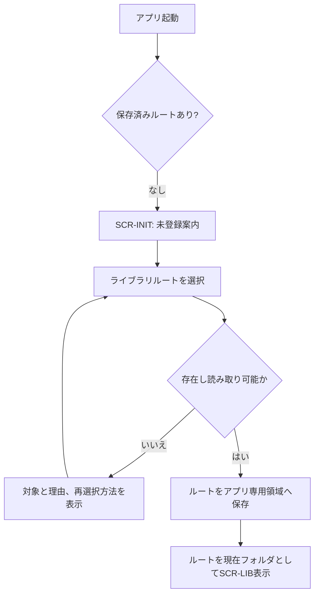
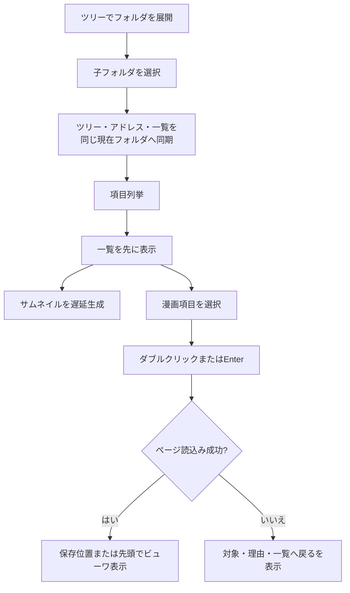
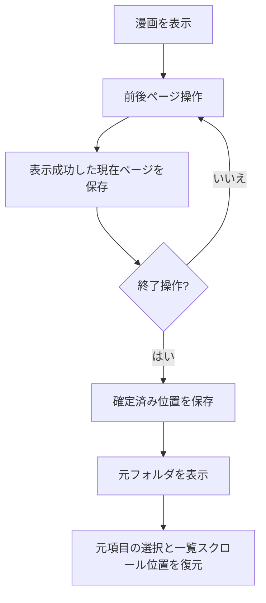
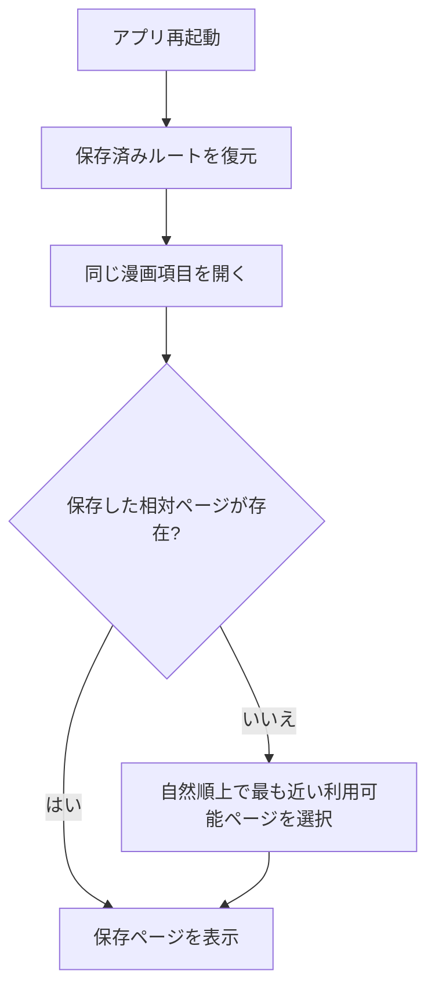
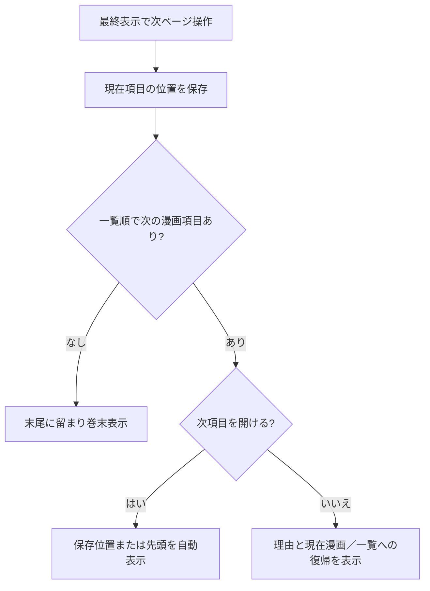
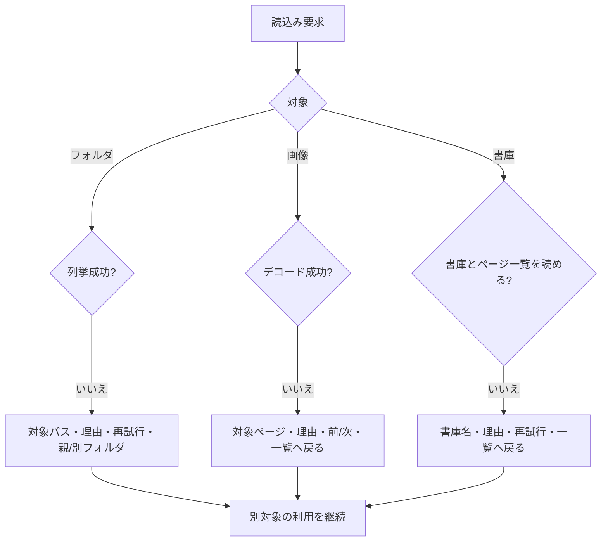
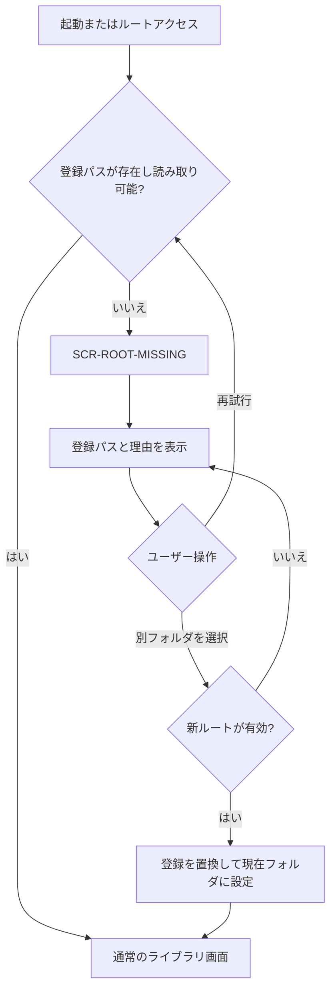
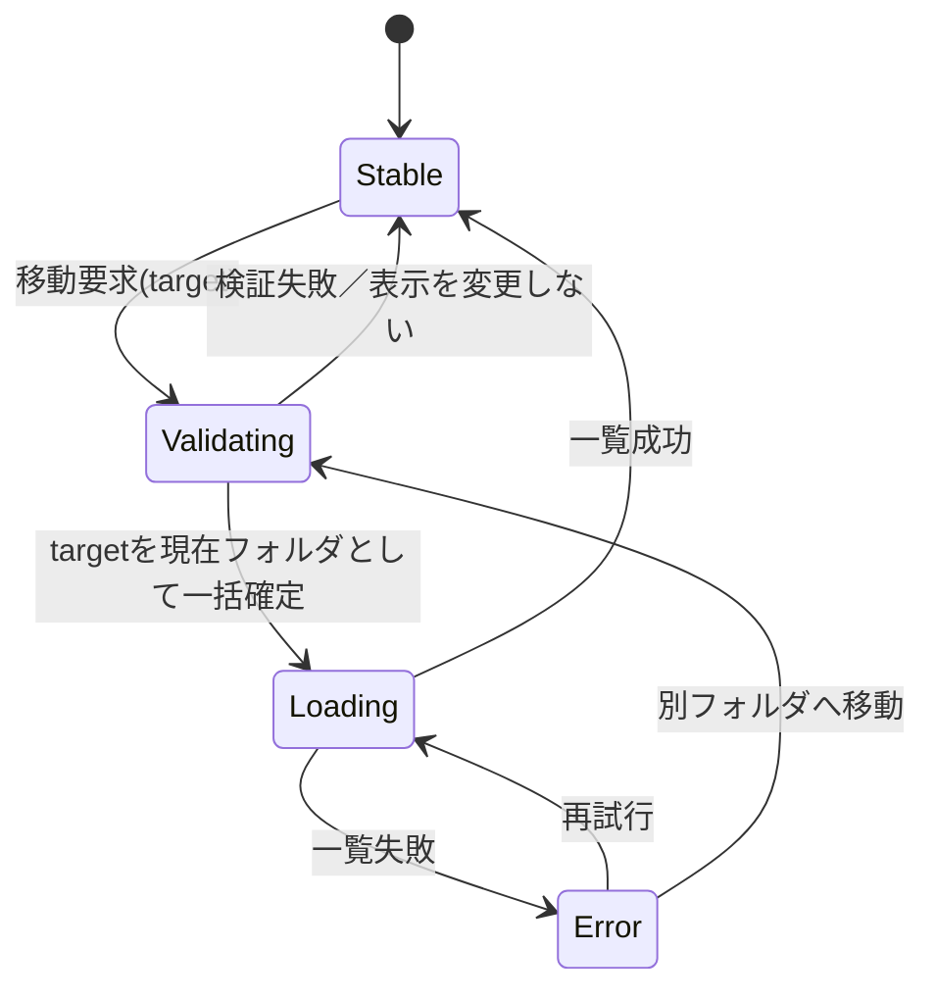
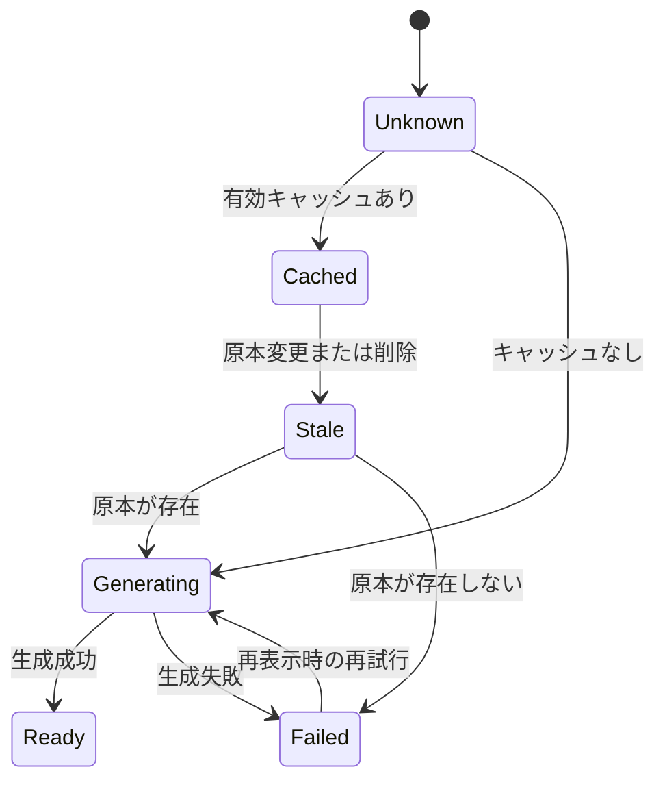

---
codd:
  node_id: "design:screen-flow"
  type: design
  status: approved
  depends_on:
    - id: "req:mvp-requirements"
      relation: "derives_from"
      semantic: "governance"
---

# Comic Explorer 画面構成・操作フロー設計

## 承認記録

- 内容承認者：ユーザー
- 内容承認日：2026-07-29
- 承認範囲：現行の画面構成、操作フロー、状態整合規則
- 制約：製造開始は別途指示があるまで行わない
- 留保：第12章の未決事項は、承認によって解消済みとは扱わない

## 1. 文書の目的と範囲

本書は Comic Explorer MVP の画面構成、操作、状態遷移および画面間の整合規則を、実装と受入試験へ落とせる粒度で定義する。要件の優先資料は `docs/requirements/mvp-requirements.md` とし、参考 UI は `docs/requirements/product-questionnaire.md` の「Leeyes - comic」方針を用いる。

本書は画面設計のみを対象とし、技術スタック、配布方式の詳細、ソースコード、テストコードを定義しない。検索、表示形式切替、ズーム、フルスクリーン、ショートカット編集、ファイル変更操作など、MVP 対象外の機能は画面へ設けない。

## 2. 設計原則

- Windows デスクトップアプリらしい高密度な一画面構成を採用する。
- ライブラリルート配下は固定の作者・作品・巻構造を仮定せず、通常のファイルシステム階層として扱う。
- ライブラリ画面の `現在のフォルダ` を単一の正とし、ツリー、アドレスバー、中央一覧を同期する。
- 漫画原本は常に読み取り専用とし、キャッシュ、設定、読書位置はライブラリルート外のアプリ専用領域へ保存する。
- 低速処理と項目単位の失敗は画面全体をブロックしない。継続可能な操作と回復操作を明示する。
- 色やアイコンだけに依存せず、文字、形状、フォーカス枠を併用する。
- 画面上の並べ替え条件は、巻末で「次の漫画項目」を決める規則にも使う。

## 3. 画面・画面状態一覧

| ID | 画面・状態 | 入口 | 主な表示と出口 |
| --- | --- | --- | --- |
| SCR-INIT | 初回起動・ルート未登録 | 保存済みルートがない起動 | 説明、`ライブラリルートを選択`。登録成功で SCR-LIB |
| SCR-LIB | ライブラリ画面 | 有効なルートの復元、ビューワ終了 | ツリー、一覧、ナビゲーション、ステータス |
| SCR-FOLDER-LOAD | フォルダ読込み中 | 現在フォルダ変更 | 一覧の進捗表示。成功で SCR-LIB、失敗で ERR-FOLDER |
| SCR-THUMB-LOAD | サムネイル生成中 | 一覧項目の列挙後 | 項目ごとのプレースホルダーと進捗。完了しても画面遷移なし |
| SCR-SELECTED | フォルダ／書庫選択 | 一覧で選択 | 選択背景、種別ラベル、フォーカス枠、ステータス詳細 |
| SCR-VIEW-1 | 単ページビューワ | 漫画項目を単ページで開く／切替 | 1ページを全体フィット。終了で保存元の SCR-LIB |
| SCR-VIEW-2 | 見開きビューワ | 漫画項目を見開きで開く／切替 | 最大2ページ。横長は自動単独。終了で SCR-LIB |
| SCR-ERROR | 読込み失敗 | フォルダ、画像、書庫の読込み失敗 | 対象、理由、回復操作。アプリは継続 |
| SCR-END | 巻末 | 最終ページで次ページ操作 | 次項目を自動で開く。なければ巻末表示のまま留まる |
| SCR-ROOT-MISSING | 登録済みルート消失／読取不能 | 起動時または利用中の検出 | 登録パス、理由、`再試行`、`別のフォルダを選択` |

SCR-FOLDER-LOAD、SCR-THUMB-LOAD、SCR-SELECTED、SCR-END は独立ウィンドウではなく、それぞれ SCR-LIB またはビューワに重なる状態である。

## 4. ライブラリ画面

### 4.1 ASCII ワイヤーフレーム

```text
+----------------------------------------------------------------------------------+
| [メニューバー] ファイル  表示  移動  ヘルプ                                     |
+----------------------------------------------------------------------------------+
| [ツールバー] [← 戻る] [→ 進む] [↑ 上へ]  並べ替え:[名前▼] [昇順▲]               |
+----------------------------------------------------------------------------------+
| [アドレスバー] C:\Comics\Series                                      [移動]      |
+------------------------+---------------------------------------------------------+
| [フォルダツリー]       | [中央サムネイル一覧]                                   |
| ▾ Comics               | ┌────────┐ ┌────────┐ ┌────────┐                       |
|   ▸ Author A            | │フォルダ│ │ 表紙   │ │生成中… │                       |
|   ▾ Author B            | │Series  │ │Vol01   │ │Vol02   │                       |
|     > Series            | └────────┘ └────────┘ └────────┘                       |
|                        ||                                                         |
|     選択／フォーカス   ||             縦スクロール                               |
+------------------------+---------------------------------------------------------+
| [ステータスバー] 12項目 | 選択: Vol01.cbz | ZIP/CBZ | 124 MB | 生成 8/12         |
+----------------------------------------------------------------------------------+
               ↑ ドラッグ可能な縦スプリッター
```

ウィンドウ拡大時は中央一覧の列数と表示行数を増やし、ツリー幅は維持する。クライアント領域の最小寸法は1024×720 CSS px、ツリー幅は初期240 CSS px、最小180 CSS px、サムネイル項目は176×248 CSS pxとする。縦スプリッターで両ペインをリサイズ可能とし、最小寸法を下回るサイズにはウィンドウを縮小できない。上部3領域とステータスバーの高さは固定し、中央領域だけを伸縮する。ツリーと一覧はそれぞれ独立して縦スクロールする。Windows表示倍率100〜200%ではCSS pxを論理寸法として扱い、OSのDPIスケーリングへ追従する。

### 4.2 領域定義

| 領域 | 内容・操作 |
| --- | --- |
| メニューバー | `ファイル`: ルート選択、終了。`表示`: 並べ替え条件・方向。`移動`: 戻る、進む、上へ。`ヘルプ`: アプリ内のオフラインキー操作一覧を開く。MVP対象外コマンドは置かない |
| ツールバー | 戻る、進む、上へ、並べ替え条件、昇順／降順。無効操作は無効表示と説明ツールチップを示す |
| アドレスバー | 現在フォルダの正規化済み絶対パス。編集して Enter または `移動` で確定、Esc で編集前へ戻す |
| フォルダツリー | ライブラリルートを唯一の起点とする。展開・折りたたみとフォルダ選択を提供する |
| 中央一覧 | 現在フォルダ直下のサブフォルダ、漫画フォルダとして開ける対象、ZIP／CBZを大きいサムネイルで表示する |
| ステータスバー | 総項目数、選択数または選択名、種類、取得できる場合はサイズ、サムネイル進捗、フォルダ読込み状態、簡潔なエラー |

`サイズ` はファイルではファイルサイズ、フォルダでは列挙時に容易に取得できる値がないため `—` とする。フォルダの再帰集計は性能と意味が未確定なので行わない。

### 4.3 項目の外観

| 種別／状態 | 見分け方 |
| --- | --- |
| 通常フォルダ | フォルダ形アイコン、種別ラベル `フォルダ`、表示名。直下／配下に対応画像があるかの判定完了前もフォルダとして表示 |
| 漫画フォルダ | 表紙サムネイルに小さなフォルダ形バッジ、種別ラベル `漫画フォルダ` |
| ZIP／CBZ | 表紙サムネイルに書庫形バッジ、種別ラベル `ZIP` または `CBZ` |
| サムネイル生成中 | 固定寸法プレースホルダー、進捗インジケーター、文字 `生成中`。項目の寸法と並び順は変えない |
| サムネイル生成失敗 | 種別別プレースホルダー、警告マーク、文字 `表紙を表示できません`。項目自体は選択・オープン可能 |
| ホバー | 薄い背景と境界。選択やフォーカスは変更しない |
| 選択 | OSテーマに追従する選択背景と文字色。ステータスバーを同期する |
| キーボードフォーカス | 選択背景とは独立した高コントラストの実線枠。非選択項目にも表示可能 |
| 無効 | 低コントラスト化に加え、コマンドは無効状態を文字またはツールチップで説明 |

表示名は最大2行とし、領域を超える部分は末尾を省略記号で示す。ホバー時のツールチップ、フォーカス時のアクセシブル名、およびステータスバーで完全な名前を確認できる。名前だけで種別を判別させない。

### 4.4 ナビゲーションと同期

- ツリー選択、一覧内フォルダのダブルクリック／Enter、戻る、進む、上へ、有効なパス入力を、すべて `現在フォルダ変更要求` として扱う。
- 変更要求時に対象がライブラリルート配下で読み取り可能か検証する。成功した時だけ `現在のフォルダ` を一括更新し、ツリー選択、アドレス、一覧読込みを同じパスへコミットする。
- 通常移動は変更前のフォルダを戻る履歴へ積み、進む履歴を消去する。戻る／進む自身は両スタック間を移す。失敗した移動は履歴へ追加しない。
- `上へ` はルートで無効。ルート外の直接入力は拒否し、現在フォルダを維持する。
- 一覧のフォルダは、対応画像の有無にかかわらずEnterまたはダブルクリックで
  フォルダ移動する。漫画フォルダは、ツールバー／コンテキストメニューの`読む`
  またはCtrl+Enterでビューワを開く。ZIP／CBZはEnterまたはダブルクリックで
  ビューワを開く。
- 現在フォルダ変更後、ツリーは対象ノードまで祖先を展開し、対象を選択して可視範囲へスクロールする。

### 4.5 並べ替え

並べ替え条件は `名前`、`更新日時`、`サイズ`、`種類`、方向は `昇順`、`降順` とする。ツールバーと表示メニューの双方で現在値にチェック／矢印を表示する。同じ条件を再選択すると方向を反転し、別条件を選択した場合はその条件へ切り替えて現在の方向を維持する。

名前は自然順を使う。数字列の数値が同じ場合は正規化前UTF-16序数、さらに同じ
場合は相対パスのUTF-16序数で決着する。Unicode正規化やロケール依存比較はしない。
更新日時またはサイズを取得できない項目は昇順／降順とも末尾へ置く。種類の昇順は
通常フォルダ、漫画フォルダ、ZIP、CBZとする。主条件が同じ項目は名前自然順、
正規化済み絶対パスのUTF-16序数順で最終決着し、降順では欠損値を末尾に保って
種類順と値順を反転する。並べ替え後も同一項目の選択を保持し、その項目を可視範囲へ
移す。初回は名前・昇順とし、条件と方向は変更時に保存してアプリ再起動後に復元する。

### 4.6 読込み中の操作

| 処理状態 | 許可する操作 | 禁止／保留する操作 |
| --- | --- | --- |
| フォルダ列挙中 | 戻る、進む、上へ、別ツリーノード選択、別パス入力、既に表示済み項目の選択、アプリ終了 | 未列挙項目への操作、現在フォルダの結果確定前の漫画オープン |
| サムネイル生成中 | 全ナビゲーション、並べ替え、選択、項目オープン、スクロール、アプリ終了 | なし。未生成画像だけプレースホルダー |
| 漫画ページ読込み中 | 終了、一覧へ戻る | 同じ漫画を重複して開く操作。ページ確定前の連続入力は最新の有効な移動要求だけを処理する |

フォルダ変更で旧処理が不要になった場合、その結果を現画面へ反映しない。進捗表示には対象フォルダ名を含め、別のフォルダの結果と誤認させない。

### 4.7 読み取りエラーからの復帰

- フォルダ列挙失敗: 一覧領域に対象パス、理由、`再試行`、`親フォルダへ`（ルート以外）、`別のフォルダを選択` を表示する。ツリーとナビゲーションは利用可能に保つ。
- サムネイル失敗: 項目内プレースホルダーで局所表示し、選択、開く、他フォルダへの移動を許可する。
- 消失項目: オープン時に対象と理由を表示し、`一覧を再読み込み` または `閉じる` を提示する。自動削除・修復はしない。
- ルート消失: SCR-ROOT-MISSINGへ移行し、登録済みパスを表示する。`再試行` または OS のフォルダ選択 UI による再登録だけを提示する。

利用者向けの理由は次の固定分類とし、対象、回復操作と組み合わせて表示する。

| 分類 | 表示文言 |
| --- | --- |
| `アクセスできません` | `権限または他のアプリによる使用状況を確認してください。` |
| `見つかりません` | `対象が移動または削除された可能性があります。` |
| `対応していません` | `対応する画像、ZIP、CBZを選んでください。` |
| `データが破損しています` | `ファイルを読み込めません。` |
| `暗号化されています` | `暗号化された書庫は開けません。` |
| `一時的に使用できません` | `しばらくしてから再試行してください。` |
| `アプリデータを再初期化しました` | `漫画ファイルは変更していません。` |

分類不能な内部情報、例外名、スタックトレースはメインUIへ表示せず、診断ログだけへ記録する。

## 5. 漫画ビューワ

初回起動時の表示モードは単ページとする。利用者が単ページ／見開きを切り替えた
場合はその値を保存し、次回起動後のビューワ開始時に復元する。

### 5.1 単ページワイヤーフレーム

```text
+----------------------------------------------------------------------------------+
| [ビューワ上部バー] Vol01.cbz | 単ページ | 右開き | 12 / 180 | [表示切替] [終了] |
+----------------------------------------------------------------------------------+
|          前ページクリック領域 | 次ページクリック領域（読み方向で左右反転）      |
|                                |                                                 |
|                         ┌──────────────────┐                                     |
|                         │                  │                                     |
|                         │   [現在ページ]   │  アスペクト比維持・全体フィット      |
|                         │                  │                                     |
|                         └──────────────────┘                                     |
|                                                                                |
+----------------------------------------------------------------------------------+
| [状態表示] 読込み中／エラー／巻末（必要な場合のみ）                              |
+----------------------------------------------------------------------------------+
```

### 5.2 見開きワイヤーフレーム

```text
+----------------------------------------------------------------------------------+
| [ビューワ上部バー] Vol01 | 見開き | 右開き | 12-13 / 180 | [表示切替] [終了]    |
+----------------------------------------------------------------------------------+
|       次へ領域          |                     |              前へ領域             |
|               ┌─────────────────┬─────────────────┐                              |
|               │ 13: 次ページ    │ 12: 先頭ページ  │  ← 右開き                    |
|               │                 │                 │                              |
|               └─────────────────┴─────────────────┘                              |
|       左開きでは 12 を左、13 を右へ配置。横長ページは中央へ単独表示。            |
+----------------------------------------------------------------------------------+
| [状態表示] 読込み中／エラー／巻末（必要な場合のみ）                              |
+----------------------------------------------------------------------------------+
```

ウィンドウサイズ変更時は上部バーを固定し、残りを表示領域とする。単ページは画像全体が収まる最大倍率、見開きはページ間の間隔を含む最大2ページ全体が収まる共通倍率を用いる。ただし倍率の上限は100%とし、表示領域より小さい画像は原寸のまま中央へ配置する。常にアスペクト比を維持し、画像を変形・切り抜きしない。

### 5.3 ページ配置と移動

- 単ページは現在ページを1枚表示する。
- 見開きは現在ページを進行方向の先頭とし、次の連続ページがあれば最大2枚表示する。
- 右開きは先頭ページを右、次ページを左へ置く。左開きは先頭を左、次を右へ置く。
- 横幅が高さより大きいページは見開き画像とみなし、見開きモードでも単独表示する。次のページと組にしない。
- 見開き末尾に1ページだけ残る場合は単独表示する。
- 単ページ／見開き切替時は、切替前の先頭ページを切替後の現在ページとする。
- 読み方向切替時も現在の先頭ページを維持し、左右配置、クリック領域、左右キーの意味を即時更新する。
- ページ表示は `現在ページ / 総ページ数`、見開きは `先頭-末尾 / 総ページ数` とする。総ページ数の確定前は `現在 / 読込中` とする。

### 5.4 既定入力

| 入力 | 動作 |
| --- | --- |
| `PageDown`、`Space`、ホイール下 | 次ページ／次の見開きへ |
| `PageUp`、`Shift+Space`、ホイール上 | 前ページ／前の見開きへ |
| `→` / `←` | 画面上でその方向にあるページへ進む。右開きでは `←` が次、`→` が前、左開きでは逆 |
| `Esc` | ビューワ終了 |
| `1` | 単ページへ切替 |
| `2` | 見開きへ切替 |
| `R` | 右開き／左開きを切替 |
| 左右クリック領域 | 読み方向上、その側が示す前／次へ移動 |
| 上部バーのボタン | 表示モード切替、読み方向切替、終了 |

クリック領域は表示領域を左右50%に分ける。ただし上部バー、エラー操作、その他のボタンはページ領域より優先する。ポインターを置いた領域には `前ページ` または `次ページ` の文字付きオーバーレイを表示する。見開きでは通常2ページ分、横長単独では1ページ分進む。前移動は直前に表示した組の先頭へ戻り、横長や末尾1ページを含んでもページを飛ばさない。

### 5.5 読込み・失敗表示

- 読込み中は表示領域中央に進捗と対象ページ名を示し、可能なら直前ページを薄く残す。終了操作は常に可能とする。
- 破損画像はページ位置を保ったエラーパネルに対象の相対パス、`画像を読み込めません`、得られた理由、`前ページ`、`次ページ`、`一覧へ戻る` を表示する。自動スキップはせず、ユーザーの次ページ操作でスキップできる。
- 破損、暗号化、未対応方式の書庫は、対象書庫名と理由、`再試行`、`一覧へ戻る` を表示する。ページ一覧を確定できない場合はビューワ操作を開始しない。
- 表示可能ページが0件の場合は対象名、理由、`一覧へ戻る` を示す。
- エラーがあってもアプリ全体を終了せず、原本を修復、展開、上書き、削除しない。

### 5.6 エラーワイヤーフレーム

```text
+----------------------------------------------------------------------------------+
| [エラー発生領域: 一覧またはビューワ]                                              |
|                                                                                  |
|  ! 読み込みに失敗しました                                                        |
|  対象: C:\Comics\Series\Vol02.cbz                                                 |
|  理由: 書庫が破損しているか、対応していない方式です                              |
|                                                                                  |
|  [再試行] [一覧へ戻る]                  原本への変更は行いません                 |
|                                                                                  |
+----------------------------------------------------------------------------------+
```

エラーは対象のある領域内に表示し、フォーカスを見出しへ移して読み上げ可能にする。既定フォーカスは安全で継続可能な操作（ビューワでは `一覧へ戻る`、フォルダでは `再試行`）とする。ダイアログが必要な場合も対象パスと回復操作を省略しない。

### 5.7 読書位置と終了

- ページ表示が成功し、現在ページとして確定した直後に、漫画項目の正規化済みパス、ページ相対パス、補助的なページ順序をアプリ専用ローカルデータへ保存する。
- 見開きでは先頭として表示したページを保存する。モード切替だけでも先頭が変わらなければ位置を再保存する必要はない。
- ビューワ終了、次の漫画への遷移、アプリ正常終了の直前にも確定済み位置を保存する。未確定の読込み要求は保存しない。
- 保存先はライブラリルート外とし、漫画原本へ管理ファイルを作らない。
- 保存ページが見つからない場合は、保存した相対パスの自然順上で最も近い利用可能
  ページを選び、復元したページ番号を表示する。前後が同距離なら旧位置以後にある
  後方候補を優先する。
- 読書位置DBが破損または非対応スキーマの場合は、アプリ専用領域の`recovery`へ
  元DBを時刻付き名称で隔離し、空DBで継続する。読書位置を再初期化したことと
  隔離先を通知し、ライブラリ原本へは書き込まない。
- ビューワ開始時に、元フォルダ、一覧の選択項目、縦スクロール位置、並べ替え条件・方向を復帰コンテキストとして保持する。
- 終了時は元フォルダへ戻り、再列挙後に同一漫画項目を選択して、保存したスクロール位置を復元する。項目が消失した場合は元フォルダの一覧先頭へ戻り、消失をステータスで通知する。

### 5.8 巻末と次の漫画

最終ページを含む表示で次ページ操作を受けた時点を巻末到達とする。現在の親フォルダ、ビューワを開いた時点の並べ替え条件・方向に基づく一覧で、現在項目の直後にある漫画項目を次項目とする。通常フォルダなど漫画でない項目は候補から除外する。

- 次項目があれば確認なしで自動的に開く。現在項目の読書位置を保存し、次項目に保存位置があればそこ、なければ先頭ページを表示する。
- 次項目が開けない場合は対象と理由を示し、`現在の漫画へ戻る` と `一覧へ戻る` を提示する。さらに後の項目へ自動スキップしない。
- 次項目がなければ現在の末尾へ留まり、`このフォルダの最後の漫画です` と `一覧へ戻る` を表示する。次ページ操作を繰り返してもループしない。
- ビューワ中に親フォルダ内容が変化した場合の一覧再評価タイミングは、自動ファイル監視がMVP対象外であるため、ビューワ開始時のスナップショットを使う。

## 6. 操作フロー

### 6.1 初回起動からライブラリルート登録



### 6.2 ツリーから漫画を見つけて開く



### 6.3 読み、終了して一覧へ戻る



### 6.4 再起動後に前回ページから再開



### 6.5 巻末から次の漫画へ移動



### 6.6 フォルダ・画像・書庫の読込み失敗



### 6.7 登録済みルート消失



## 7. 操作定義表

| 操作ID | 画面 | 開始状態 | 入力手段 | ユーザー操作 | 成功時の結果 | 失敗時の結果 | 永続化 | 対応要件ID |
| --- | --- | --- | --- | --- | --- | --- | --- | --- |
| OP-001 | SCR-INIT / ROOT-MISSING | ルートなし／無効 | マウス、Tab+Enter | ルート選択からフォルダを確定 | ルートを保存しSCR-LIBへ | 対象と理由、再選択を表示 | ルートパス | REQ-MVP-001,019 |
| OP-002 | SCR-LIB | ツリーにノード表示 | クリック、`→`/`←` | 展開／折りたたみ | 子を表示／非表示 | ノード内に読取エラー、他操作継続 | なし | REQ-MVP-003,019 |
| OP-003 | SCR-LIB | 読取可能ノード | クリック、矢印+Enter | フォルダ選択 | 三領域を同期し一覧読込み | 現在フォルダ維持、回復操作表示 | なし | REQ-MVP-002〜004,019 |
| OP-004 | SCR-LIB | 履歴／親が有効 | ボタン、Alt+Left/Right、Alt+Up | 戻る／進む／上へ | 対応フォルダへ同期移動 | 移動せず理由表示 | セッション履歴のみ | REQ-MVP-004 |
| OP-005 | SCR-LIB | アドレス編集可 | Ctrl+L、入力、Enter | パス直接入力 | ルート配下の有効フォルダへ移動 | 入力維持、理由表示、現在表示不変 | なし | REQ-MVP-004,019 |
| OP-006 | SCR-LIB | 一覧表示済み | メニュー、ツールバー | 条件または方向を選択 | 欠落なく再配列し表示を更新 | 現在順を維持しエラー表示 | 条件・方向 | REQ-MVP-007 |
| OP-007 | SCR-LIB | 項目表示済み | クリック、矢印キー | 漫画項目を選択 | 背景、フォーカス、ステータスを同期 | 消失時は再読込み案内 | なし | REQ-MVP-005,NFR-MVP-003 |
| OP-008 | SCR-LIB | 漫画フォルダまたは書庫を選択 | `読む`、Ctrl+Enter。ZIP／CBZはダブルクリック、Enterも可 | 漫画項目を開く | 保存ページまたは先頭でビューワへ | 対象、理由、一覧復帰を表示 | 復帰コンテキストはセッション内 | REQ-MVP-005,008〜010,015,019 |
| OP-009 | VIEW-1/2 | 有効ページ表示 | PageUp、Shift+Space、ホイール上、方向クリック | 前ページ | 前の1ページ／組を表示 | 先頭に留まる。読込失敗は局所表示 | 成功表示ページ | REQ-MVP-011,012,014,015 |
| OP-010 | VIEW-1/2 | 有効ページ表示 | PageDown、Space、ホイール下、方向クリック | 次ページ | 次の1ページ／組、巻末なら次項目 | 画像エラー表示、次項目失敗時は復帰選択 | 成功表示ページ | REQ-MVP-011,012,014〜016,019 |
| OP-011 | VIEW-1/2 | ビューワ表示中 | `1`/`2`、上部ボタン | 単ページ／見開き切替 | 先頭ページ維持で再配置 | 元モードを維持し理由表示 | 表示モード | REQ-MVP-011,012,015 |
| OP-012 | VIEW-1/2 | ビューワ表示中 | `R`、上部ボタン | 右開き／左開き切替 | 配置と操作方向を即時反映 | 元設定を維持し理由表示 | 読み方向 | REQ-MVP-013,014 |
| OP-013 | VIEW-1/2/ERROR | ビューワ表示中 | Esc、終了ボタン | ビューワ終了 | 位置保存、元フォルダ・選択・スクロール復元 | 復元不可なら一覧先頭と通知 | 読書位置 | REQ-MVP-010,014,015 |
| OP-014 | SCR-END | 巻末で次項目あり | 次ページ入力 | 次の漫画を開く | 一覧順の次項目を自動表示 | 理由と現在漫画／一覧への復帰 | 現項目と次項目の確定位置 | REQ-MVP-016,019,E2E-MVP-003 |
| OP-015 | SCR-ERROR | 読込みエラー表示 | Tab+Enter、クリック、Esc | 一覧へ戻る | 元フォルダと可能なら元選択を復元 | フォルダも無効ならROOT-MISSINGまたは親へ | 確定済み位置のみ | REQ-MVP-009,010,019 |
| OP-016 | SCR-LIB | フォルダ選択 | ダブルクリック、Enter | フォルダを開く | 対応画像の有無にかかわらず現在フォルダとして同期移動 | 現在表示を維持し回復操作 | なし | REQ-MVP-002〜005,019 |
| OP-017 | SCR-ERROR | 再試行可能 | クリック、Tab+Enter | 読込みを再試行 | 成功状態へ戻る | エラー情報を更新し継続 | なし | REQ-MVP-019 |

補足として、ライブラリ操作の既定キーは `Tab/Shift+Tab`（領域移動）、矢印（領域内移動）、`Enter`（選択／開く）、`Space`（ツリーノード展開切替）、`F6`（ツリー・一覧・アドレスの循環）、`Ctrl+L`（アドレス編集）、`Alt+Left/Right/Up`（戻る／進む／上へ）とする。ショートカット編集UIは設けない。

## 8. 状態モデルと整合性

### 8.1 状態表

| 状態 | スコープ／初期値 | 更新契機 | 整合・復元規則 |
| --- | --- | --- | --- |
| ライブラリルート | 永続／初回はなし | OP-001 | 1つだけ。存在しなければROOT-MISSING |
| 現在のフォルダ | セッション／有効ルート | 全ナビゲーション | ルート配下かつ読取可能な成功時のみ更新 |
| 戻る／進む履歴 | セッション／空 | 成功したフォルダ移動 | 通常移動で進むを破棄。失敗は追加しない |
| ツリー選択 | セッション | 現在フォルダ確定 | 常に現在フォルダと同一パス |
| 中央一覧 | セッション | 現在フォルダ確定 | 常に現在フォルダ直下のスナップショット |
| 一覧選択 | セッション／なし | OP-007、復帰 | 項目IDで保持。フォルダ変更で解除 |
| 一覧スクロール位置 | フォルダ別セッション | スクロール、ビューワ開始 | ビューワ終了時に元フォルダの位置を復元 |
| 並べ替え条件・方向 | 永続／名前・昇順 | OP-006 | 一覧表示と次項目決定で同一値を使用し、再起動後に復元 |
| 開いている漫画項目 | ビューワセッション | OP-008/014、終了 | 元親フォルダと復帰コンテキストを保持 |
| 現在ページ | 漫画項目別・永続 | 表示成功 | 相対パスを主、順序を補助として保存 |
| 表示モード | 永続／単ページ | OP-011 | 切替時に先頭ページを維持し、再起動後に復元 |
| 読み方向 | 永続／右開き | OP-012 | 配置、キー、クリック領域へ一括適用 |
| サムネイル状態 | 項目別キャッシュ状態 | 未生成→生成中→成功／失敗 | 原本変更時は旧成功を無効化。失敗しても項目操作可 |
| エラー状態 | 対象領域別／なし | 読込失敗、再試行、移動 | 対象、理由、回復操作を保持。成功または離脱で解除 |

### 8.2 現在フォルダの原子的同期規則



以下を不変条件とする。

1. `tree.selectedPath == address.displayedPath == list.parentPath == currentFolder`。
2. アドレス編集中の未確定文字列は例外であり、確定までは別の `address.editBuffer` として扱い、表示中一覧の親を変えない。
3. 一覧の非同期結果には要求時のフォルダIDを付け、現在フォルダと一致しない旧結果を破棄する。
4. 現在フォルダ確定と同時に、ツリー選択とアドレス表示を更新し、中央一覧を当該フォルダの読込み状態へ置換する。三者の一部だけを成功状態にしない。
5. 一覧選択とステータスバーの選択名は同一項目IDから導出する。
6. ビューワの読み方向は、ページ配置、方向キー、クリック領域のラベルと動作へ同じ更新で反映する。
7. 次項目決定には、ビューワ開始時に保持した親フォルダの項目スナップショットと並べ替え条件・方向を使う。

### 8.3 サムネイル状態遷移



`Cached` と `Ready` は表紙を表示する。`Unknown`、`Generating`、`Stale` はプレースホルダー、`Failed` は失敗プレースホルダーを表示する。失敗時にも原本を変更しない。

## 9. アクセシビリティ

- キーボードだけでルート登録、ツリー移動、フォルダ選択、一覧選択、漫画オープン、前後ページ、モード／方向切替、終了、エラー復帰を完了できる。
- ライブラリ画面の Tab 順は、メニューバー → ツールバー → アドレスバー → フォルダツリー → 中央一覧 → ステータス上の操作可能要素（存在時）とする。`F6` はアドレスバー → ツリー → 一覧を循環する。
- ビューワの Tab 順は、上部バーのモード → 読み方向 → 終了 → エラー回復ボタン（存在時）とする。ページ前後移動はフォーカス位置に依存しない既定キーで実行できる。
- 選択は操作対象のデータ状態、フォーカスは次のキーボード入力先として別々に描画する。フォーカス枠を選択背景だけで代用しない。
- フォルダ、漫画フォルダ、書庫、生成中、失敗、無効は、アイコンに加えて文字ラベルまたはアクセシブル名で伝える。
- エラー発生時はフォーカス／読み上げ通知をエラー見出しへ移し、対象パス、失敗理由、利用可能な回復操作を順に提示する。
- `ヘルプ` のキー操作一覧はアプリ内のオフライン画面として開き、Tabで内容と閉じる操作へ移動できる。Escまたは閉じる操作で一覧を閉じ、呼び出し元のフォーカスへ戻す。
- 省略名には完全なアクセシブル名を設定し、ツールチップが使えないキーボード利用者にはステータスバーでも完全名を示す。

## 10. 要件トレーサビリティ

| 要件ID | 対応する設計 | 補足／画面操作がない理由 |
| --- | --- | --- |
| REQ-MVP-001 | SCR-INIT, SCR-ROOT-MISSING, OP-001, フロー6.1/6.7 | ルート1件と永続化 |
| REQ-MVP-002 | SCR-LIB, OP-003/016, 4.3/4.4 | 固定階層やメタデータ推定なし |
| REQ-MVP-003 | SCR-LIBツリー, OP-002/003 | 展開、折りたたみ、選択、失敗継続 |
| REQ-MVP-004 | ツール／アドレス, OP-004/005, 8.2 | 履歴とルート境界 |
| REQ-MVP-005 | 中央一覧, 4.1〜4.3, OP-007 | 種別、長名、選択、件数、スクロール |
| REQ-MVP-006 | SCR-THUMB-LOAD, 4.3/4.6, 8.3 | 遅延生成、失敗、キャッシュ再利用 |
| REQ-MVP-007 | 4.5, OP-006, 8.1 | 4条件・2方向と表示 |
| REQ-MVP-008 | SCR-VIEW-1/2, 5.3/5.5, OP-008〜010 | 自然順の詳細は要件を適用 |
| REQ-MVP-009 | SCR-VIEW-1/2/ERROR, 5.5, OP-008/015 | 原本位置へ展開しない |
| REQ-MVP-010 | OP-008/013, 5.7, フロー6.2/6.3 | 保存位置から開き一覧文脈へ戻る |
| REQ-MVP-011 | SCR-VIEW-1, 5.1/5.3/5.4 | 全体フィット、単ページ移動 |
| REQ-MVP-012 | SCR-VIEW-2, 5.2/5.3 | 左右配置、横長単独、末尾 |
| REQ-MVP-013 | 5.3/5.4, OP-012, 8.1 | 右開き初期値と永続化 |
| REQ-MVP-014 | 5.4, OP-009〜013, 9 | マウス、ホイール、固定キー |
| REQ-MVP-015 | 5.7, OP-009〜014, フロー6.3/6.4 | 成功表示直後と終了前に保存 |
| REQ-MVP-016 | SCR-END, 5.8, OP-014, フロー6.5 | 確認なしの自動移動 |
| REQ-MVP-017 | 2, 5.5/5.7, 8.3 | 非破壊は全画面共通。変更操作なし |
| REQ-MVP-018 | 2, 5.7 | UI操作なし。全処理をローカル完結とし外部送信要素を設けない |
| REQ-MVP-019 | SCR-ERROR/ROOT-MISSING, 4.7, 5.5/5.6, OP-015/017 | 対象・理由・回復操作と継続 |
| NFR-MVP-001 | 4.6, 8.3 | 画面外サムネイルを遅延処理し全件同時保持を前提にしない |
| NFR-MVP-002 | 4.6, 5.5 | 非同期表示で操作可能性を維持。具体的計測条件は性能設計事項 |
| NFR-MVP-003 | 4.3, 5.4, 9 | キーボード完結、選択とフォーカスの区別 |
| NFR-MVP-004 | 該当画面なし | 依存関係とライセンスのアーキテクチャ／配布設計要件であり、本書では技術を確定しない |
| NFR-MVP-005 | SCR-INIT/LIB/VIEWのWindows UI原則 | インストール／アンインストールは配布設計事項。原本変更操作は設けない |
| E2E-MVP-001 | フロー6.1〜6.4, OP-001〜013 | 画像フォルダ、見開き、右開き、再開を連結 |
| E2E-MVP-002 | 5.5/5.7, OP-008〜010 | ZIP／CBZを展開・変更せず、キャッシュは専用領域 |
| E2E-MVP-003 | 5.8, OP-014, フロー6.5 | 一覧順の次漫画を自動表示 |

## 11. 要件から補完した設計判断

以下はMVP要件を変更せず、操作を一意にするために本書で具体化した。

1. 読書位置はページ表示成功直後に保存し、終了・次項目遷移時にも再確認する。
2. 破損画像は自動スキップせずエラーページを表示し、ユーザーの前後操作で継続できる。
3. 次の漫画が開けない場合、それより後を自動探索せず、現在漫画または一覧へ戻す。
4. 次項目の順序はビューワ開始時の一覧スナップショットを用い、自動ファイル監視を導入しない。
5. フォルダ読込み中も既存のナビゲーションを使え、旧非同期結果を現画面へ反映しない。
6. 既定キーを固定し、方向キーは読み方向と画面上の左右配置に一致させる。
7. 一覧の長名は2行省略とし、ツールチップ、アクセシブル名、ステータスバーで完全名を確認可能にする。
8. フォルダサイズは再帰計算せず `—` とし、一覧表示の応答性を優先する。
9. 数字同値とUnicodeを含む自然順は正規化前UTF-16序数で最終決着し、OS列挙順と
   ロケールへ依存させない。
10. 漫画フォルダのEnter／ダブルクリックは移動、`読む`／Ctrl+Enterは閲覧とする。
11. 読書位置の同距離復元は後方候補を優先し、DB障害時は元DBを隔離して継続する。
12. 並べ替えは名前・昇順、表示モードは単ページを初期値とし、いずれも変更後は永続化する。
13. ビューワは100%を超えて画像を拡大せず、小画像は原寸で中央表示する。
14. 最小クライアント領域を1024×720 CSS px、ツリーを初期240／最小180 CSS px、サムネイル項目を176×248 CSS pxとする。
15. キー操作一覧はアプリ内のオフライン画面とし、Escまたは閉じる操作で元のフォーカスへ戻す。

## 12. 解決済みUI判断

| ID | 決定 | 根拠 |
| --- | --- | --- |
| TBD-SF-003 | 名前・昇順を初期値とし、条件と方向を永続化する | 一覧順と「次の漫画」の挙動を再起動後も一貫させる |
| TBD-SF-004 | 100%を上限とし、小画像は原寸中央表示する | 不要な補間による画質劣化を避ける |
| TBD-SF-006 | 単ページを初期値とし、変更後の表示モードを永続化する | 初回動作を一意にし、継続利用時の操作負担を減らす |
| TBD-SF-007 | 最小1024×720 CSS px、ツリー初期240／最小180 CSS px、項目176×248 CSS px | 100〜200%表示倍率で論理寸法を維持する |
| TBD-SF-008 | 7分類の固定文言を使い、メインUIへスタックトレースを出さない | 回復操作を明確化し、内部情報の露出を避ける |
| TBD-SF-009 | アプリ内のオフラインキー操作一覧とする | 配布物だけで参照でき、元画面へ確実に復帰できる |

TBD-SF-001〜009は2026-07-29にMVP要件へ確定反映した。性能基準PC、
インストーラー、技術スタックは承認済み要件、性能計画、ADR-001を正とする。
